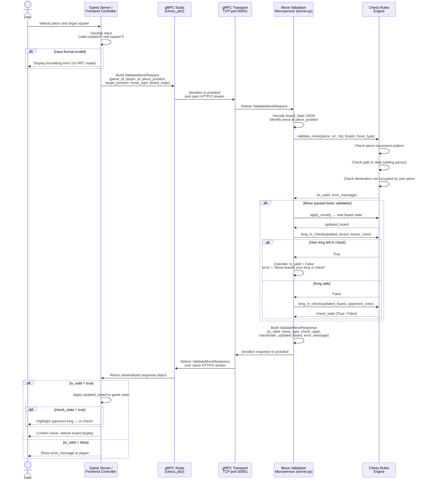

# MoveValidationMicroservice
A microservice for CS361 where it validates the moves that you make for chess


# Chess Move Validation Microservice
**CS 361 – Microservice A**

> ⚠️ **Communication contract — do not alter the request/response schema once teammates have integrated.**

---

## 1. What this microservice does

This microservice receives a chess move request from any caller (game server, frontend controller, another microservice) and determines whether the move is legal according to official chess rules.

It enforces:
- Legal movement patterns for all six piece types (pawn, rook, bishop, queen, knight, king)
- Path-blocking detection for sliding pieces (rook, bishop, queen)
- Capture rules (cannot capture your own piece)
- Self-check prevention (a move that leaves your own king in check is rejected)
- Special move types: castling, en passant, pawn promotion
- Detection of whether the opponent is placed in check after a valid move

The service runs as a **gRPC server on port 50051** and handles up to 10 concurrent game sessions.

---

## 2. How to REQUEST data from the microservice

### Setup (one time)

```bash
pip install grpcio grpcio-tools
```

The two generated stub files (`chess_pb2.py`, `chess_pb2_grpc.py`) must be in the same directory as your calling code. They are included in this repo — do not regenerate them unless `chess.proto` changes.

### Starting the microservice

```bash
python3 server.py
```

You should see:
```
[SERVER] Microservice listening on port 50051  (Ctrl+C to stop)
```

The microservice must be running before any caller can connect.

### Making a request — example call

```python
import grpc
import json
import chess_pb2
import chess_pb2_grpc

# 1. Open a channel to the microservice
channel = grpc.insecure_channel("localhost:50051")
stub = chess_pb2_grpc.MoveValidatorStub(channel)

# 2. Describe the current board as a dict {square: piece}
board = {
    "E1": "WHITE_KING",  "E8": "BLACK_KING",
    "E2": "WHITE_PAWN",  "D7": "BLACK_PAWN",
    # ... full board state
}

# 3. Build and send the request
request = chess_pb2.ValidateMoveRequest(
    game_id         = "game_204",        # unique ID for the game session
    player_id       = "player_white",    # ID of the player making the move
    piece_position  = "E2",              # square the piece is moving FROM
    target_position = "E4",              # square the piece is moving TO
    move_type       = "NORMAL",          # NORMAL | CASTLE | PROMOTION | EN_PASSANT
    board_state     = json.dumps(board), # full board encoded as JSON string
)

response = stub.ValidateMove(request)
```

### Request parameters

| Parameter | Type | Required | Description |
|---|---|---|---|
| `game_id` | string | ✅ | Unique identifier for the chess game session |
| `player_id` | string | ✅ | Identifier for the player making the move |
| `piece_position` | string | ✅ | Current square of the piece, e.g. `"E2"` |
| `target_position` | string | ✅ | Destination square, e.g. `"E4"` |
| `move_type` | string | ✅ | One of: `NORMAL`, `CASTLE`, `PROMOTION`, `EN_PASSANT` |
| `board_state` | string | ✅ | JSON-encoded dict of the full board layout (see format below) |

### Board state format

```json
{
  "A1": "WHITE_ROOK",
  "B1": "WHITE_KNIGHT",
  "E1": "WHITE_KING",
  "E2": "WHITE_PAWN",
  "E8": "BLACK_KING",
  "D7": "BLACK_PAWN"
}
```

Piece names follow the pattern `"{COLOR}_{TYPE}"` where color is `WHITE` or `BLACK` and type is one of `PAWN`, `ROOK`, `KNIGHT`, `BISHOP`, `QUEEN`, `KING`. Squares not present in the dict are treated as empty.

---

## 3. How to RECEIVE data from the microservice

The call to `stub.ValidateMove(request)` is **synchronous** — it blocks until the microservice responds, then returns a `ValidateMoveResponse` object directly. There is no polling or callback required.

### Reading the response — example call

```python
response = stub.ValidateMove(request)

if response.is_valid:
    print("Move accepted!")

    # Update your board with the new state
    updated_board = json.loads(response.updated_board)

    if response.check_state:
        print("Opponent is now in check!")
    if response.checkmate:
        print("Checkmate — game over!")
else:
    # Move was rejected — tell the player why
    print(f"Illegal move: {response.error_message}")
```

### Response fields

| Field | Type | Description |
|---|---|---|
| `is_valid` | bool | `True` if the move is legal; `False` if rejected |
| `move_type` | string | Echo of the move type sent in the request |
| `check_state` | bool | `True` if the opponent's king is in check after this move |
| `checkmate` | bool | `True` if the opponent has no legal moves remaining |
| `updated_board` | string | JSON-encoded board dict after the move (only populated when `is_valid=True`) |
| `error_message` | string | Human-readable reason for rejection (only populated when `is_valid=False`) |

### Example responses

**Valid move (E2 → E4):**
```json
{
  "is_valid": true,
  "move_type": "NORMAL",
  "check_state": false,
  "checkmate": false,
  "updated_board": { "E4": "WHITE_PAWN", "E1": "WHITE_KING" },
  "error_message": ""
}
```

**Invalid move (bishop blocked):**
```json
{
  "is_valid": false,
  "move_type": "NORMAL",
  "check_state": false,
  "checkmate": false,
  "updated_board": {},
  "error_message": "Path blocked at D2"
}
```

---

## 4. UML Sequence Diagram



---

## File reference

| File | Purpose |
|---|---|
| `chess.proto` | Source of truth for the communication contract |
| `chess_pb2.py` | Auto-generated message classes (do not edit) |
| `chess_pb2_grpc.py` | Auto-generated service stubs (do not edit) |
| `server.py` | The microservice — run this first |
| `test_client.py` | Standalone test program with 10 test cases |

## Running the test suite

```bash
# Terminal 1
python3 server.py

# Terminal 2
python3 test_client.py
```

All 10 tests should report `PASS` and the final line should read `Results: 10 passed / 0 failed / 10 total`.
